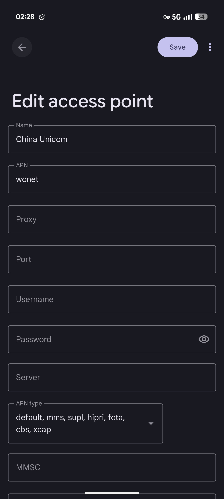

# Pixel 9 Pro XL (Komodo) 入门指南（自用）

## 1.启用国内三大运营商VoLTE和5G

需要用到的工具

Pixel IMS https://github.com/kyujin-cho/pixel-volte-patch

shizuku https://play.google.com/store/apps/details?id=moe.shizuku.privileged.api

plaform tools https://developer.android.com/tools/releases/platform-tools?hl=zh-cn

安装打开shizuku并在无线调试配对，接下来安装打开Pixel IMS 勾选VoLTE, Vo5G 即可.   
冬尽了@bilibili的视频教程 https://www.bilibili.com/video/BV1F4HczgEPv

### 另外一个IMS补丁
  vvb2060/ims 补丁: https://github.com/vvb2060/Ims/releases
  安装shizuku并无线调试配对，安装IMS 临时补丁。在shizuku授权停止服务重新开启服务即可    
> 可以参考冬尽了@bilibili的 临时补丁教程 https://www.bilibili.com/video/BV1oz4PzxESS    

  中国联通用户安装补丁后不能蜂窝数据上网，看下APN是否为空，需要添加wonet APN 如下图:    

## 2.Pixel IMS修改信号阈值  

> Pixel IMS 因为被2025年10月Google更新封堵，等作者更新或使用临时补丁

        根据Google发布的信号强度报告，我们得知这个信号强弱的显示与`KEY_5G_NR_SSRSRP_THRESHOLDS_INT_ARRAY`这个数组有关

        我们查看这个数组的默认值为`[-110,-90,-80,-65]`，在国内对于4G来说是信号差的-90dbm，从理论上对于5G已经是能跑到何同学速度的信号强度了，我们修改这个数组的值就好了

        那你肯定会说，这不是中国建设完全偷工减料，改了纯属掩耳盗铃？恰好相反，AOSP默认的显示是根据4G时代的信号标准设计的，它基本上是直接把4G的阈值复制到了5G！

        改了有啥用? 美观舒服也能**防止一格信号的时候4G和5G来回自动切换耗电**

        [Pixel IMS](https://github.com/kyujin-cho/pixel-volte-patch) 激活后，在底部导航栏选择你的手机卡，滑到最下方选择手动设置，将`KEY_5G_NR_SSRSRP_THRESHOLDS_INT_ARRAY`（类型`IntArray`）改为你手机厂商的默认系统值就好了。例如 `-115,-105,-95,-85`，一定注意**数值从小到大！** 

        如果你不知道你手机对应的值，这里有张表可以参考一下

*1006-4222-(2019)11-0158-02 表 各厂商手机信号阈值*

| 厂商   | 4格   | 3格   | 2格   | 1格   |
|:----:| ---- | ---- | ---- | ---- |
| 运营商A | -105 | -114 | -118 | -123 |
| 三星   | -85  | -95  | -105 | -115 |
| OPPO | -97  | -105 | -113 | -120 |
| VIVO | -97  | -105 | -110 | -115 |
| 华为   | -90  | -103 | -113 | -120 |

文献来源

> https://www.irvingwu.blog/posts/aosp-5g-signal-strength

> ps. 慢慢写吧！
